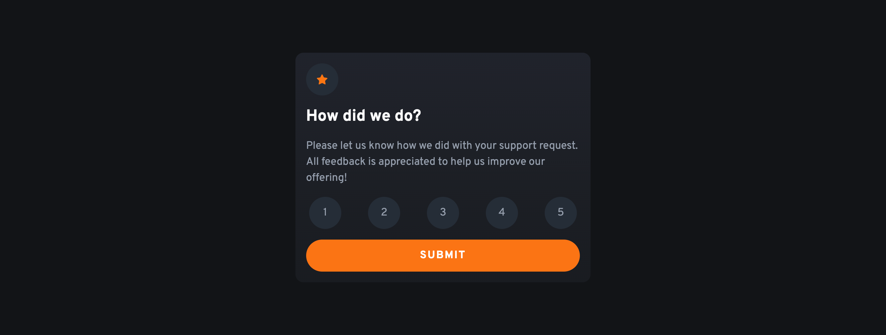
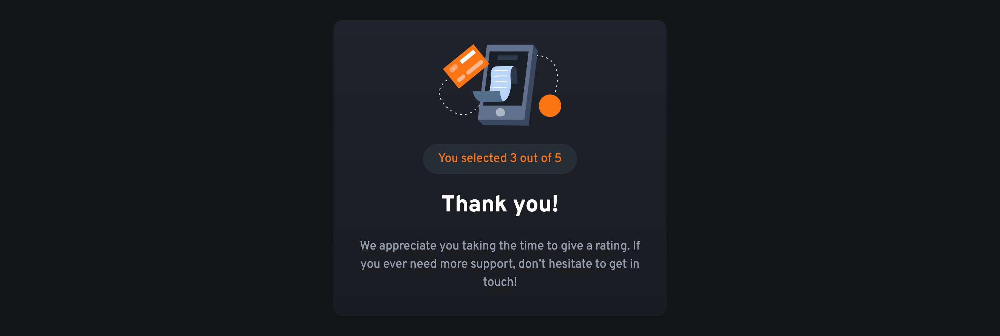

# Frontend Mentor - Interactive rating component solution

This is a solution to the [Interactive rating component challenge on Frontend Mentor](https://www.frontendmentor.io/challenges/interactive-rating-component-koxpeBUmI). Frontend Mentor challenges help you improve your coding skills by building realistic projects. 

## Table of contents

- [Overview](#overview)
  - [The challenge](#the-challenge)
  - [Screenshot](#screenshot)
  - [Links](#links)
- [My process](#my-process)
  - [Built with](#built-with)
  - [What I learned](#what-i-learned)
  - [Continued development](#continued-development)
  - [Useful resources](#useful-resources)
- [Author](#author)

**Note: Delete this note and update the table of contents based on what sections you keep.**

## Overview

### The challenge

Users should be able to:

- View the optimal layout for the app depending on their device's screen size
- See hover states for all interactive elements on the page
- Select and submit a number rating
- See the "Thank you" card state after submitting a rating

### Screenshot

- Desktop Version



### Links

- Solution URL: [https://github.com/vitaovich/frontend-interactive-rating-component-main](https://github.com/vitaovich/frontend-interactive-rating-component-main)
- Live Site URL: [https://delightful-wave-0150ddd1e.2.azurestaticapps.net](https://delightful-wave-0150ddd1e.2.azurestaticapps.net)

## My process

### Built with

- Mobile-first workflow
- [React](https://reactjs.org/) - JS library
- [Next.js](https://nextjs.org/) - React framework
- [TailwindCSS](https://tailwindcss.com) - For styles
- [Azure Static Web Apps](https://azure.microsoft.com/en-us/products/app-service/static) - For deployment and hosting
- [Google Fonts](https://fonts.google.com/specimen/Overpass)

### What I learned

- Applying NextJS Font Optimization ([With Tailwind CSS](https://nextjs.org/docs/basic-features/font-optimization#with-tailwind-css))

  - source file: [_app.tsx](https://github.com/vitaovich/frontend-interactive-rating-component-main/blob/main/pages/_app.tsx)
    ```tsx
    import { Overpass } from '@next/font/google'

    const overpass = Overpass({
      subsets: ['latin'],
      variable: '--font-overpass'
    })

    export default function App({ Component, pageProps }: AppProps) {
      return (
        <main className={`${overpass.variable}`}>
          <Component {...pageProps} />
        </main>
      )
    }
    ```
  - source file: [tailwind.config.js](https://github.com/vitaovich/frontend-interactive-rating-component-main/blob/main/tailwind.config.js)
    ```js
    theme: {
        ...
        fontFamily: {
          overpass: ['var(--font-overpass)'],
        },
      }
    ```

- Using useRef() to handle the selected ratings
  - source file: [ratingButton.tsx](https://github.com/vitaovich/frontend-interactive-rating-component-main/blob/main/components/ratingButton.tsx)
    ```tsx
    const ratingRef = useRef<HTMLButtonElement>(null)
    const handleRatingClick = () => {
        if (ratingRef.current?.innerText !== undefined) {
            props.onRatingClick(parseInt(ratingRef.current?.innerText))
        }
    }
    ```

- Tailwind CSS gradient background ([Ending color](https://tailwindcss.com/docs/gradient-color-stops#ending-color))

  ```css
  bg-gradient-to-b from-darkBlueTop to-darkBlueBottom
  ```

### Continued development

I plan to continue diving deeper into React and NextJS for tougher challenges requiring more interactivity.

### Useful resources

- [Deploy hybrid Next.js websites on Azure Static Web Apps](https://learn.microsoft.com/en-us/azure/static-web-apps/deploy-nextjs-hybrid) - Useful for learning how I deployed my site.
- [Learn to use Bash with the Azure CLI](https://learn.microsoft.com/en-us/cli/azure/azure-cli-learn-bash) - Useful for how to use scripting with Azure CLI

## Author

- Website - [Vitaliy Alekhnovich](https://www.vitoal.com)
- Frontend Mentor - [@vitaovich](https://www.frontendmentor.io/profile/vitaovich)